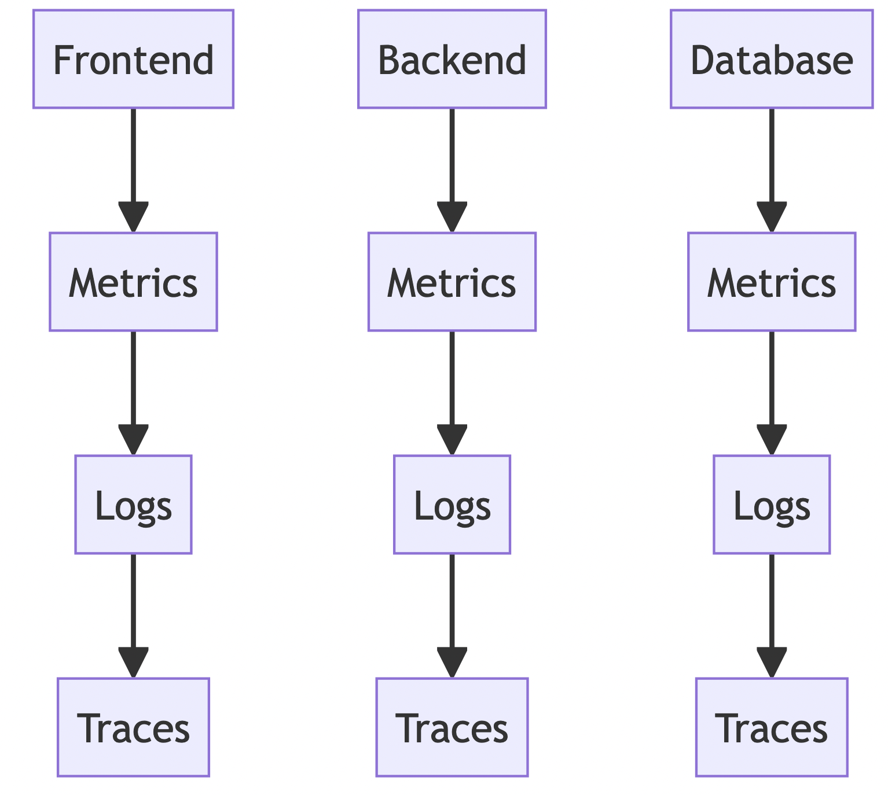

 # Observability
Github repo that discuss different observability standdards, terminologies, tools, farmeworks and patterns.

## What is Observability?
Observability is a concept that originates from control theory and has been widely adopted in the field of software engineering. It refers to the ability to understand and monitor the internal state of a system based on the external outputs it produces. In simpler terms, it’s about being able to "see" what's going on inside a system by analyzing the data it generates.

> For a distributed systems like microservices, these external outputs are basically known as telemetry data. It includes information like the resource consumption of a machine, the logs generated by the applications running on a machine, and several others things.

The more observable a system, the more quickly and accurately you can navigate from an identified performance problem to its root cause, without additional testing or coding.

Observability provides deep visibility into modern distributed applications for faster, automated problem identification and resolution.

## Key Components/Pillars of Observability

We can organize telemetry data/key compoennts of observability into three categories that we refer to as the three pillars of observability: logs, metrics, and traces.

1. **Logs**: Textual records of events that occur within a system, often used to diagnose issues or understand system behavior over time. Logs are granular, timestamped, complete and immutable records of application events. Among other things, logs can be used to create a high-fidelity, millisecond-by-millisecond record of every event, complete with surrounding context. Developers can use these logs to 'play back' for troubleshooting and debugging purposes. Normally logs are structured and often generated at different levels of severity. These are quite easy to generate but often carry performance costs. Moreover, we may require additional tools like Logstash to collect, store, and analyze logs efficiently.
2. **Metrics**: Quantitative data that measure different aspects of system performance, such as CPU usage, memory usage, request rates, error rates, etc. Metrics are values represented as counts or measures that we calculate or aggregate over a time period. Metrics(sometimes called time series metrics) are fundamental measures of application and system health over a given period of time. The metrics measure, for example, how much memory or CPU capacity an application uses over a five-minute span, or how much latency an application experiences during a spike in usage.
3. **Traces**: Records of the journey of a request as it travels through various components of a system (mainly distributed systems), useful for understanding end-to-end latency and pinpointing where delays occur. Traces are important for distributed systems where a single request can flow through multiple applications. A trace is a representation of distributed events as the request flows through a distributed system.

## Observability vs. Monitoring

- **Monitoring** is about collecting and displaying predefined sets of metrics to ensure the system is running as expected.
- **Observability** goes further, providing the ability to explore and understand the system's state and behavior even when unexpected issues arise.

## Example and Diagrams

Imagine we have a simple web application consisting of three main components/layers: a frontend, a backend, and a database. Here’s how we might apply observability to this system:

1. **Metrics**: We collect metrics like:
   - Response time of the frontend.
   - Number of requests per second handled by the backend.
   - Query execution time in the database.

2. **Logs**: We generate logs for:
   - User login attempts (frontend).
   - API calls and responses (backend).
   - SQL queries executed (database).

3. **Traces**: We track traces for:
   - A user’s request journey from the frontend, through the backend, to the database, and back.

### Diagram 1: System Components

+----------+ +---------+ +----------+

| Frontend | ---> | Backend | ---> | Database |

+----------+ +---------+ +----------+

### Diagram 2: Observability Data Flow

### Example Scenario: Diagnosing an Issue

Imagine users are complaining that the web application is slow. Using observability tools, you can:

1. **Check Metrics**: Notice that the backend's response time has increased significantly.
2. **Examine Logs**: Look into the backend logs to see if there are any errors or unusual entries that coincide with the slowdown.
3. **Trace Requests**: Use tracing to follow the path of a request through the system. You might find that the delay is occurring when the backend queries the database.

By analyzing the data collected, you might discover that a specific database query is taking longer than usual due to a large amount of data being processed. This insight allows you to address the issue, perhaps by optimizing the query or indexing the database appropriately.

## Summary

Observability is crucial for understanding and maintaining the health of complex systems. By leveraging metrics, logs, and traces, you can gain deep insights into your system's behavior, diagnose problems quickly, and ensure a smooth user experience.

