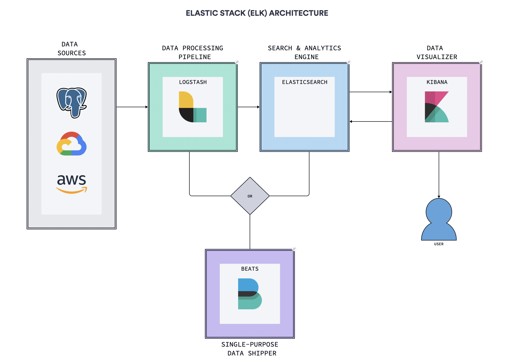
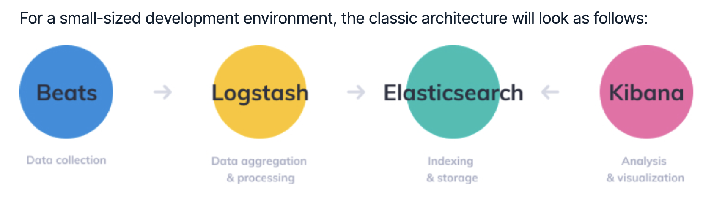

# ELK Stack

ELK often referred as Elasticsearch and acronym stands for Elasticsearch, Logstash and Kibana.

ELK Stack is very popular log management platform. The ELK Stack began as a collection of three open-source products — Elasticsearch, Logstash, and Kibana — all developed, managed and maintained by Elastic. The introduction and subsequent addition of Beats turned the stack into a four legged project.

ELK stack is powerful open source software stack which gives you the ability to aggregate logs from all your systems and applications, analyze these logs, and create visualizations for application and infrastructure monitoring, faster troubleshooting, security analytics, and more.

* **`Elasticsearch`** is a distributed search and analytics engine built on Apache Lucene. Elasticsearch is a full-text search and analysis engine, based on the Apache Lucene open source search engine. Since its release in 2010, Elasticsearch has quickly become the most popular search engine and is commonly used for log analytics, full-text search, security intelligence, business analytics, and operational intelligence use cases.
* **`Logstash`** is a lightweight, open-source, server-side data processing pipeline that allows you to collect data from various sources, transform it on the fly, and send it to your desired destination. It is most often used as a data pipeline for Elasticsearch, an open-source analytics and search engine. Because of its tight integration with Elasticsearch, powerful log processing capabilities, and over 200 prebuilt open-source plugins that can help you easily index your data, Logstash is a popular choice for loading data into Elasticsearch. It’s important to know that many modern implementations of ELK do not include Logstash. To replace its log processing capabilities, most turn to lightweight alternatives like Fluentd, which can also collect logs from data sources and forward them to Elasticsearch.
* **`Kibana`** is a data visualization and exploration tool used for log and time-series analytics, application monitoring, and operational intelligence use cases. It offers powerful and easy-to-use features such as histograms, line graphs, pie charts, heat maps, and built-in geospatial support. Also, it provides tight integration with Elasticsearch, a popular analytics and search engine, which makes Kibana the default choice for visualizing data stored in Elasticsearch.
* **`Beats`** Beats are lightweight agents that are installed on edge hosts to collect different types of data for forwarding into the stack. Beats and (formerly) Logstash take care of data collection and processing

The centralized log management and analytics solutions such as the ELK Stack come into the picture, allowing engineers, whether DevOps, IT Operations or SREs, to gain the visibility they need and ensure apps are available and performant at all times.

Modern log management and analysis solutions include the following key capabilities:

- Aggregation – the ability to collect and ship logs from multiple data sources.
- Processing – the ability to transform log messages into meaningful data for easier analysis.
- Storage – the ability to store data for extended time periods to allow for monitoring, trend analysis, and security use cases.
- Analysis – the ability to dissect the data by querying it and creating visualizations and dashboards on top of it.

sourced from [terrastruct](https://terrastruct.com/examples/post/elastic-stack-elk-architecture-diagram/)

sourced from [logz.io](https://logz.io/learn/complete-guide-elk-stack/#what-elk-stack)

## Addendum
1. https://terrastruct.com/examples/post/elastic-stack-elk-architecture-diagram/
2. https://logz.io/learn/complete-guide-elk-stack/#what-elk-stack